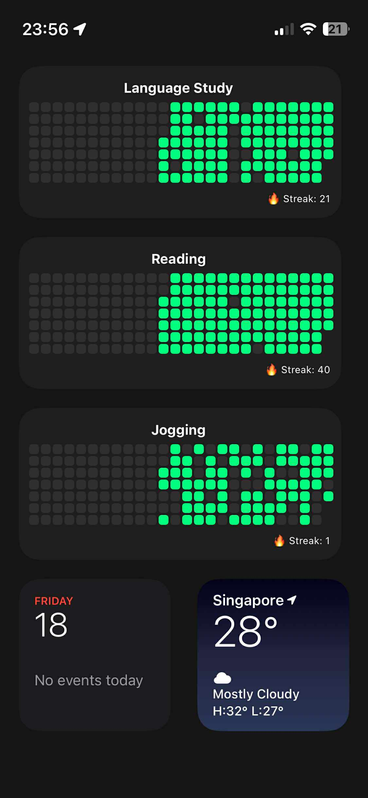

# Streakify

**Streakify** is a completely free habit streak tracker for iPhone, built with [Scriptable](https://scriptable.app).  
Track your habits with a streak grid, just like GitHub or LeetCode! Most similar iOS tools are paid, but Streakify is open-source and forever free.

  

- **Visualize your progress** in a beautiful streak grid
- **No ads, no hidden costs**
- **Customizable for any habit** (reading, studying, etc.)

> Powered by Scriptable – a free automation app for iOS.  
> No need for any subscription or login.

## Prerequisites

Before you start:
- Download [Scriptable](https://apps.apple.com/app/scriptable/id1405459188) from the iOS App Store (it’s free).

## Components
### Tracker (`Tracker.js`)
This is your main habit tracking tool:
- Tap to mark/unmark today as complete.
- Shows your past **180 days** as a colored streak grid.
- Displays your current streak count.

### Fixer (`Fixer.js`)
Did you forget to log a day?  
No worries—use the Fixer tool to correct or backfill your past data.  
- Edit past days you forgot to record
- Keep your streak honest and accurate

## Getting Started

1. Download Scriptable from the App Store
2. Add `Tracker.js` and `Fixer.js` to Scriptable
3. Long press the home page.
4. Select `Edit`
5. Select `Add Widget`
6. Choose `Scritable`
7. Tap the widget to log your progress, use the Fixer to correct past days

